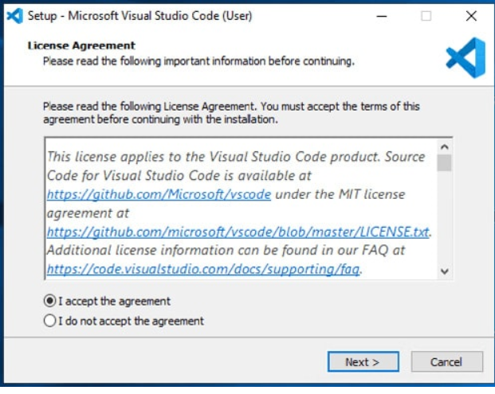

# SE-Assignment-5
Installation and Navigation of Visual Studio Code (VS Code)
 Instructions:
Answer the following questions based on your understanding of the installation and navigation of Visual Studio Code (VS Code). Provide detailed explanations and examples where appropriate.

 Questions:

1. Installation of VS Code:
   - Describe the steps to download and install Visual Studio Code on Windows 11 operating system. Include any prerequisites that might be needed.

ANS: Step-by-step insturctions on how to download and install VS Code on Windows 11.
Prerequisites: A computer with administrative access, Internet connection. 
Step One: Download VS Code the official website (https://www.code.visualstudio.com/download)

Step Two: Install VS Code.
Install VS Code by opening the downloaded setup file and following the prompts

License  Agreement.
Click “I accept the agreement” and click "Next"

Click "Next" or click "Browse" if you want to select different location to install

Check the box if you don’t want to create Start Menu Folder and click "Next"

Make sure to check the box “Add to PATH” to avoid the installation path to be manually added to Environment Variables and check the box “Create a desktop icon” and click "Next"

Click “Next” to install

   Click “Finish”

2. First-time Setup:
   - After installing VS Code, what initial configurations and settings should be adjusted for an optimal coding environment? Mention any important settings or extensions.

ANS: When setting up Visual Studio Code (VS Code) for an optimal coding environment, consider the following steps:

1. EXTENSIONS:
   Install relevant extensions based on your programming language and workflow. VS Code has a rich marketplace with extensions for various languages, frameworks, and tools. Some popular ones include:
   Python: “Python”, “Pylance”

   JavaScript/TypeScript: “ESLint”, “Debugger for Chrome”

   C++: “C/C++”, “Code Runner”

   Git: “GitLens”, “GitHub Pull Requests and Issues”

2. USER SETTINGS: 
   Customize global settings by going to File > Preferences > Settings. You can modify options like font size, theme, and keybindings. These settings apply to all instances of VS Code you open1.

3. WORKSPACE SETTINGS: 
   For project-specific configurations, use workspace settings. These are stored inside your workspace and apply only when that workspace is opened. To set workspace-specific settings, create a .vscode folder in your project root and add a settings.json file.

4. EDITOR PREFERENCES:
   Font and Theme: Choose a font and theme that suits your preference. You can install custom themes from the marketplace.

   Indentation: Set your preferred indentation (spaces or tabs) in the editor.

   Line Numbers: Enable line numbers for better code navigation.

5. KEYBINDINGS: 
   Customize keyboard shortcuts to streamline your workflow. Access keybindings via File > Preferences > Keyboard Shortcuts.

6. INTELLISENSE AND AUTOCOMPLETION:
   Ensure IntelliSense is enabled for your language. It provides context-aware autocompletion and suggestions.
   Configure IntelliSense settings specific to your project.

7. VERSION CONTROL INTEGRATION:
   If you’re using Git, install the “GitLens” extension for enhanced Git integration.
   Explore other version control extensions based on your needs.

8. DEBUGGING CONFIGURATION:
   Set up debugging configurations for your language. Define launch configurations in .vscode/launch.json.
   Install relevant debuggers (e.g., “Debugger for Chrome” for web development).

9. TERNINAL INTEGRATION:
   Customize the integrated terminal (e.g., PowerShell, Bash).
   Set default shell and configure terminal profiles.

10. EXTENSIONS FOR SPECIFIC LANGUAGES AND FRAMEWORDKS:
   Explore extensions related to your tech stack (e.g., React, Angular, Django).
   Install linters, formatters, and language-specific tools

3. User Interface Overview:
   - Explain the main components of the VS Code user interface. Identify and describe the purpose of the Activity Bar, Side Bar, Editor Group, and Status Bar.

The Visual Studio Code (VS Code) user interface consists of several key components:

1. EDITOR AREA: This is where you write and edit your code. It’s the central part of the interface. You can open multiple files in separate tabs within the editor area.

2. SIDEBAR(EXPLORER): Located on the left, the sidebar provides access to files and folders in your workspace. You can navigate through your project directory, 
   view Git changes, and manage extensions from here.

3. ACTIVITY BAR: The vertical bar on the far left contains icons for different activities:
      EXPLORER: Access files and folders.
      SOURCE CONTROL: Manage Git repositories.
      RUN AND DEBUG: Configure and run debugging sessions.
      EXTENSIONS: Install and manage VS Code extensions.
      SEARCH: Search for files or text within your project.

4. STATUS BAR: At the bottom, the status bar displays information such as the current file’s encoding, line endings, and Git branch. It also shows the 
   language mode and any active extensions.

5. TABS: Located just above the editor area, tabs represent open files. You can switch between files by clicking on their respective tabs.

6. TOOL BAR (View Bar): The toolbar contains buttons for common actions like saving, undo/redo, and toggling sidebars. It’s positioned at the top of the window.

7. INTEGRATED TERMINAL: VS Code includes a built-in terminal where you can run commands directly within the editor. You can open it using 
   the shortcut Ctrl + Backtick (or Cmd + Backtick on macOS).

8. COMMAND PELETTE: Accessed via Ctrl + Shift + P (or Cmd + Shift + P on macOS), the command palette lets you execute various commands, 
   install extensions, and configure settings.

9. QUICK OPEN: Press Ctrl + P (or Cmd + P on macOS) to quickly search for files or execute commands.

10. SETTINGS AND PREFERENCES: Customize VS Code by accessing settings via File > Preferences > Settings. 
    You can configure global settings or workspace-specific settings.

4. Command Palette:
   - What is the Command Palette in VS Code, and how can it be accessed? Provide examples of common tasks that can be performed using the Command Palette.

   ANS: The Command Palette in Visual Studio Code (VS Code) is a powerful tool that allows you to execute various commands, access features, and configure settings. 
   You can open it by pressing Ctrl + Shift + P (or Cmd + Shift + P on macOS).

   Here’s what you can do with the Command Palette:

      EXECUTE COMMAND: Type a command (e.g., “Format Document,” “Toggle Line Comment”) to quickly perform actions without navigating through menus.
      INSTALL EXTENSIONS: Search for and install VS Code extensions directly from the palette.
      CONFIGURE SETTINGS: Change global or workspace-specific settings by searching for the setting name (e.g., “Font Size”) and adjusting values.
      NAVIGATE TO FILES: Quickly open files by typing their names or paths.
      RUN TASKS: If you have defined tasks in your tasks.json file, you can run them from the palette.

5. Extensions in VS Code:
   - Discuss the role of extensions in VS Code. How can users find, install, and manage extensions? Provide examples of essential extensions for web development.

   ANS: 
   Extensions play a crucial role in enhancing Visual Studio Code (VS Code). Here’s how:

   Functionality Enhancement: Extensions add features and tools that aren’t part of the core VS Code. They extend the editor’s capabilities, making it more versatile.
   Language Support: Extensions provide language-specific features like syntax highlighting, autocompletion, and linting. For example, the “Python” extension offers Python-specific tools.
   Frameworks and Tools: Extensions support various frameworks (e.g., React, Angular) and integrate with tools (e.g., Git, Docker). They streamline development workflows.
   Themes and Icons: Extensions allow you to customize the editor’s appearance. You can install themes and icon packs to personalize your workspace.
   Debugging and Testing: Extensions enhance debugging experiences. They provide debuggers for different languages and testing frameworks.
   Productivity Boost: Extensions automate repetitive tasks, format code, and improve efficiency. Examples include code snippets and keyboard shortcuts.

   Managing extensions in Visual Studio Code (VS Code) is straightforward. Here’s how you can find, install, and manage them:

   BROWSE FOR EXTENSION:
   Click on the Extensions icon in the Activity Bar (or use the shortcut Ctrl + Shift + X on Windows or Command + Shift + X on macOS).
   You’ll see a list of popular VS Code extensions from the Marketplace.
   Each extension includes a brief description, publisher details, download count, and a rating.

   INSTALL AN EXTENSION:
   Select an extension and click the Install button.
   Once installed, the button changes to a Manage gear icon.
   For example, you can install the “TODO Highlight” extension to find and highlight “TODO:” and “FIXME:” comments in your code.

   EXPLORE INSTALLED EXTENSIONS:
   To view all installed extensions, click the three dots icon in the Extensions view.
   Select Views > Installed from the drop-down menu.
   You’ll see the list of extensions in the left-hand sidebar.

   CUSTOMIZE AND ENJOY:
   Extensions enhance VS Code’s functionality, so explore and find ones that suit your workflow.
   You can disable, update, or uninstall extensions as needed

   Here are some essential VS Code extensions for web development
   1. Prettier: Automatically formats your code using customizable rules, ensuring consistent styling
   2. JavaScript (ES6) Code Snippets: Provides code snippets for JavaScript, TypeScript, Vue, React, and HTML. A must-have for daily development
   3. CSS Peek: Allows you to jump directly to CSS code using classes and IDs
   4. Auto Close Tag: Automatically adds closing tags for HTML and XML
   5. REST Client: Test APIs and view responses directly within VS Code, eliminating the need for external tools like Postman
   6. ESLint: Linting utility for JavaScript, catching common errors as you write code
   7. GitLens: Enhances Git integration, providing detailed information about code changes
   8. Live Server: Sets up a local development server for live preview of HTML, CSS, and JavaScript changes
   9. IntelliSense for CSS Class Names in HTML: Autocompletes CSS class names in HTML files
  10. SVG Preview: Renders SVG files directly in VS Code

6. Integrated Terminal:
   - Describe how to open and use the integrated terminal in VS Code. What are the advantages of using the integrated terminal compared to an external terminal?

   In Visual Studio Code (VS Code), you can open and use the integrated terminal in the following ways:
   1. OPEN THE TERMINAL:
      From the menu, go to Terminal > New Terminal or View > Terminal.
      Alternatively, use the Command Palette (⇧⌘P or Windows/Linux: Ctrl+Shift+P) and type “Toggle Terminal.”
      In the Explorer, right-click a folder and choose Open in Integrated Terminal.
      To toggle the terminal panel, press **⌃** (Windows/Linux: Ctrl+).
      To create a new terminal, use **⌃⇧** (Windows/Linux: Ctrl+Shift+)

   2. SHELL INTEGRATION:
      VS Code’s terminal has shell integration that tracks where commands are run.
      It provides decorations on the left of a command and in the scrollbar

   3. MANAGING TERMINALS:
      Terminal tabs appear on the right side of the terminal view.
      Add terminals using the + icon or the ⌃⇧` command.
      Remove terminals by hovering over a tab and selecting the Trash Can button.
      Navigate between terminal groups using ⇧⌘ (Windows/Linux: Ctrl+PageDown) and ⇧⌘ (Windows/Linux: Ctrl+PageUp)

   4. GROUPSs (Split Panes):
      Create terminal groups by splitting a terminal:
      Hover over a terminal entry and select the inline split button.
      Right-click and choose Split.
      Alt + click on a tab or the + button.
      Trigger the ⌘\ (Windows/Linux: Ctrl+Shift+5) command.

   The integrated terminal in Visual Studio Code offers several advantages over an external terminal:

      1. SEAMLESS INTEGRATION: The integrated terminal starts at the root of your workspace, allowing you to execute commands directly within VS Code 
         without switching windows1. This streamlines your coding workflow.

      2. MULTIPLE INSTANCES: You can have multiple terminal instances open simultaneously, making it easier to manage different development tasks. 
         Each instance can run different commands or scripts.

      3. SHELL INTEGRATION: The integrated terminal supports various shells installed on your machine. It detects and presents available 
         shells in the terminal profiles dropdown1. You can configure your preferred shell.

      4. ADVANCED FEATURES: VS Code’s integrated terminal includes features like Unicode and emoji support, custom keybindings, and automatic replies.
          These enhance productivity and customization.

      5. GROUPING (Split Panes): You can place multiple terminals side-by-side by creating terminal groups. This allows you to work on different tasks simultaneously.
         In summary, the integrated terminal provides a convenient, efficient way to execute commands and manage your development tasks directly within VS Code

7. File and Folder Management:
   - Explain how to create, open, and manage files and folders in VS Code. How can users navigate between different files and directories efficiently?

   ANS: In Visual Studio Code (VS Code), you can create, open, and manage files and folders easily. Let me break it down for you:
   CREATING FILES AND FOLDERS:
   To create a new file or folder, open VS Code and select the folder where you want to create it.
   Right-click on the folder and choose “New File” or “New Folder” from the context menu.
   Alternatively, use the keyboard shortcuts: Ctrl+N for a new file and Ctrl+Shift+N for a new folder.
   Type the name of the file or folder and press Enter. 
   VS Code will automatically keep track of your open files and editor layout for that folder

   In Visual Studio Code (VS Code), there are several ways to navigate between files and directories efficiently:
   QUICK FILE NAVIGATION:
   You can open any file by typing ⌘P (Windows/Linux: Ctrl+P) to activate Quick Open. Then, type the name of the file you want to open.
   This is especially useful when you know the file’s name and want to quickly jump to it.

   SWITCHING BETWEEN OPEN FILES:
   Hold Ctrl and press Tab to view a list of all files open in the current editor group.
   To open one of these files, use Tab again to select the desired file, then release Ctrl.
   Alternatively, use ⌃- (Windows: Alt+Left, Linux: Ctrl+Alt+-) to navigate backward and ⌃⇧- (Windows: Alt+Right, Linux: Ctrl+Shift+-) to navigate forward between files and edit locations1.

   BREADCRUMBS:
   The editor has a navigation bar called Breadcrumbs above its contents.
   Breadcrumbs show the current location (file path) and allow you to quickly navigate between folders, files, and symbols.
   You can customize breadcrumb appearance and turn it on/off using settings.
   To interact with breadcrumbs, use the Focus Breadcrumbs command or press ⇧⌘. (Windows/Linux: Ctrl+Shift+.)

   EXTENSIONS:
   Consider installing extensions like “File Jumper” from the Visual Studio Marketplace.
   File Jumper allows you to right-click on a file in the file explorer panel or on a file tab and quickly jump to related files

   OPENING FILES AND FOLDERS:
   You can open a single folder as a workspace by using the “File > Open Folder…” menu.
   If you launch VS Code from a terminal, pass the path to a folder as the first argument to the code command. For example

   MANAGING WORKSPACES:
   A workspace in VS Code is a collection of one or more folders opened in a single instance.
   You can configure settings, tasks, and debugger launch configurations specific to a workspace.
   Multi-root workspaces allow you to include multiple distinct folders in the same workspace. You create a .code-workspace JSON file listing all folders.
   To add folders to a workspace, use the “File > Add Folder to Workspace…” command

8. Settings and Preferences:
   - Where can users find and customize settings in VS Code? Provide examples of how to change the theme, font size, and keybindings.

   To customize settings in Visual Studio Code (VS Code), you have a couple of options:

   SETTING EDITOR:
   Open the Settings editor by navigating to File > Preferences > Settings.
   Alternatively, you can use the Command Palette (⇧⌘P or Windows/Linux Ctrl+Shift+P) and search for Preferences: Open Settings (JSON) to directly edit the JSON-based settings.
   If you prefer a graphical interface, use Preferences: Open Settings (UI) to modify settings interactively.

   USER SETTINGS vs. WORKSPACE SETTINGS:
      VS Code has two types of settings:
         User settings: These apply globally to all projects.
         Workspace settings: These only affect the current project.
      You can configure both types to tailor your VS Code experience

      EXAMPLES

1. CHANGE THE THEME:
   To change the theme (color scheme):
      Open VS Code.
      Go to File > Preferences > Color Theme.
      Choose a theme from the list (e.g., Cobalt 2, Night Owl, Shades of Purple, or Winter is Coming).
   You can also install additional themes from the VS Code Marketplace

2. ADJUST FONT SIZE:
   To change the font size:
      Press Cmd + + (Mac) or Ctrl + + (Windows/Linux) to increase the font size.
      Press Cmd + - (Mac) or Ctrl + - (Windows/Linux) to decrease the font size.
   You can also set font size preferences in the settings (e.g., editor.fontSize, editor.suggestFontSize, markdown.preview.fontSize, and terminal.integrated.fontSize).

3. CUSTOMIZE KEYBINDINGS:
   To change keyboard shortcuts:
      Open the command palette (⇧⌘P or Windows/Linux Ctrl+Shift+P).
      Search for “Preferences: Open Keyboard Shortcuts” or “Preferences: Open Keybindings (JSON)”.
      Edit the keybindings directly or use the graphical interface to assign new shortcuts.

9. Debugging in VS Code:
   - Outline the steps to set up and start debugging a simple program in VS Code. What are some key debugging features available in VS Code?

   Debugging in Visual Studio Code (VS Code) is a powerful feature that can help you identify and fix issues in your code. Here are the steps to set up and start debugging a simple program:

   1. SET A BREAKPOINT:
      The first step is to set a breakpoint in your code. A breakpoint is a specific line where you want the debugger to pause execution. Click on the left margin of the line where you want to set the breakpoint, or use the keyboard shortcut F9.

   2. CREATE A LAUNCH CONFIGURATION:
      While you can run and debug your active file without a configuration, it’s beneficial to create a launch configuration. This configuration specifies how VS Code should run your code in debug mode.

   3. TO CREATE A LAUNCH CONFIGURATION:
      Open your Python file in VS Code.
      Click on the Debug icon in the Activity Bar on the side of the window.
      Select Create a launch.json file.
      VS Code will try to automatically detect your debug environment, but if it fails, choose it manually.

   4. START DEBUGGING:
      Press F5 or click the green play button in the top bar to start debugging.
      VS Code will execute your code and pause at the breakpoint you set.

   5. INSPECT VARIABLES:
      While debugging, you can inspect variables and expressions. Use the Variables panel to view their values.

   6. STEP THROUGH YOUR CODE:
      Use the debugging controls (step over, step into, step out) to navigate through your code line by line.
      The Call Stack panel shows the function call hierarchy.

   7. CONTINUE EXECUTION:
      To continue running your program after a breakpoint, click the play button or press F5.

   8. FIX THE ERROR:
    Once you’ve identified the issue, make necessary changes to your code and continue debugging until it works correctly.

    Visual Studio Code (VS Code) offers robust debugging features that can significantly enhance your development workflow. Here are some key features:

   Built-in Debugger:
   VS Code has a built-in debugger that supports the Node.js runtime. It can also debug JavaScript, TypeScript, and any other language transpiled to JavaScript1.
   Additionally, you can find debugger extensions for various languages (e.g., Python, Ruby, Go, C++, PowerShell) in the VS Code Marketplace.

   Breakpoints:
   Set breakpoints in your code to pause execution at specific lines. You can inspect variables and expressions at these points.
   Enhanced features include conditional breakpoints.

   Watch Variables:
   Monitor the progress of variables within scope during debugging.

   Call Stack:
   View the function call hierarchy in the Call Stack panel.

   Launch Configurations:
   Create a launch.json file to configure and save debugging settings. VS Code keeps this file in a .vscode folder within your workspace.

   Step Through Code:
   Use step-over, step-into, and step-out controls to navigate through your code line by line

10. Using Source Control:
    - How can users integrate Git with VS Code for version control? Describe the process of initializing a repository, making commits, and pushing changes to GitHub.

    Visual Studio Code (VS Code) provides seamless integration with Git for version control. Whether you’re a beginner or an experienced developer, here’s how you can get started:

   1. INSTALL GIT:
      First, ensure that Git is installed on your computer. If it’s missing, VS Code will prompt you to install it.
      Restart VS Code after installing Git.

   2. OPEN A GIT REPOSITORY:
   There are several ways to open a Git repository in VS Code:

   Clone a Repository Locally:
      Use the Git: Clone command in the Command Palette (⇧⌘P or Windows/Linux Ctrl+Shift+P).
      Authenticate with GitHub if you’re cloning from there.
      Select a repository to clone to your machine.

   Initialize a Local Repository:
      Open an existing or new folder in VS Code.
      In the Source Control view, click the Initialize Repository button.
      This creates a new Git repository in the current folder.
   
3. Publish to GitHub:
   You can initialize a local repository and publish it directly to GitHub:
      Use the “Publish to GitHub” command in the Source Control view.
      Choose a name, description, and whether it’s public or private.
      VS Code pushes your local code to the remote repository on GitHub.

5. Common Git Actions:
   Once you’re set up, perform common Git actions directly within VS Code:
      Commit changes.
      Create and merge branches.
      Push and pull code.
      Collaborate with others using commits and pull requests

Let’s walk through the process of initializing a Git repository, making commits, and pushing changes to GitHub:

1. Initialize a Repository:
      To start tracking changes in your project, navigate to the project folder in your terminal.
      Run "git init" to create a new Git repository. This initializes a hidden ".git" directory to manage version history.

2. Add and Commit Changes:
      Add files to the staging area using "git add ." (to stage all changes) or "git add <filename>" (for specific files).
      Commit the staged changes with a descriptive message using git commit -m "Your commit message".

3. Push to GitHub:
      Create a repository on GitHub (if you haven’t already).
      Add the remote repository URL to your local Git using: "git remote add origin <repository_url>"
      Push your local changes to GitHub: "git push origin master"
      Replace master with the branch name you’re working on (e.g., main).

    [SOURCE: Microsoft Copilot, Google Gemini]

 Submission Guidelines:
- Your answers should be well-structured, concise, and to the point.
- Provide screenshots or step-by-step instructions where applicable.
- Cite any references or sources you use in your answers.
- Submit your completed assignment by 1st July 

